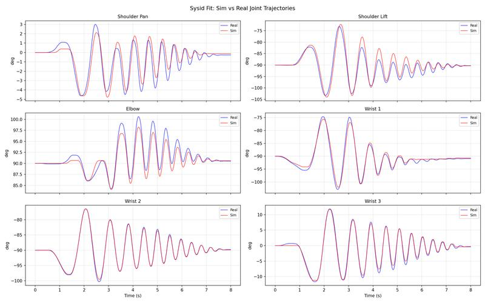
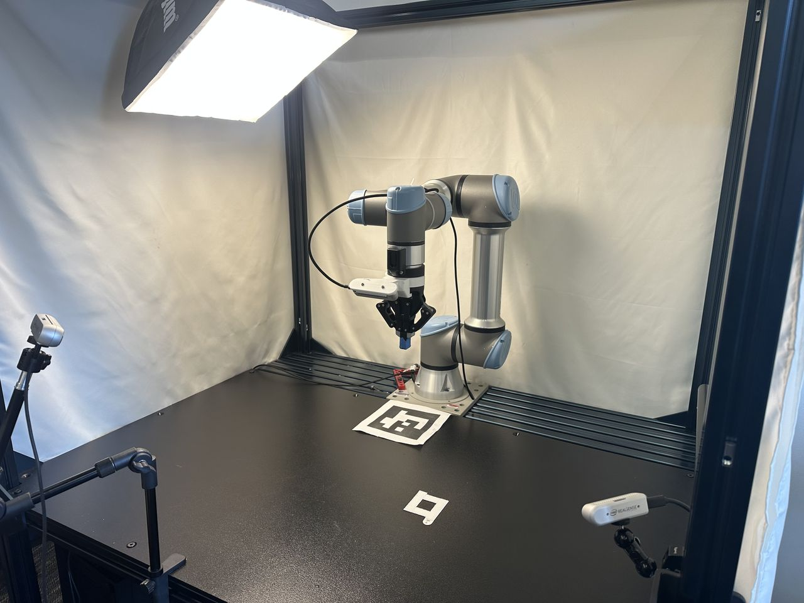

Sim2Real: SysID & RL Finetuning
================================

This guide bridges sim-to-real via system identification and policy finetuning. Finetuning uses a curriculum: sim dynamics shift toward your sys-id'd parameters (with higher OSC gains to compensate for friction, since policies do not train well under high friction from scratch), and action scale is reduced so the policy runs slower and transfers better to the real robot.

Our system identification follows the `PACE <https://arxiv.org/abs/2509.06342>`_ framework by Bjelonic et al.

.. important::

   **Prerequisite:** A trained RL policy from :doc:`rl_training`.

Pipeline overview
-----------------

1. **Robot setup** — UR5e/UR7e hardware config, robot calibration & USD, FK verification, metadata. Re-run reset state collection and RL training from :doc:`rl_training` (geometry-dependent). Install the diffusion_policy repo for real-robot control and sysid data collection.

2. **System identification** — Collect chirp on real robot, run CMA-ES in UWLab, verify fit, write sysid params to metadata, teleop to verify.

3. **Finetune** — Select best Stage-1 checkpoint, finetune with ADR, evaluate. Or use our pre-finetuned checkpoints (next section) if your setup matches ours.

4. **Camera & hardware setup** — Mount cameras (D415/D435/D455), print task objects, calibrate camera extrinsics.

5. **Next** — :doc:`distillation` for vision policy training and real-robot deployment.

----

Robot Setup
-----------

.. _installing-diffusion-policy:

Installing Diffusion Policy
----------------------------

You need this codebase to control the real UR5e/UR7e. Real-robot deployment uses a **separate** conda environment (``robodiff``) so it does not conflict with Isaac Sim / UWLab. On Ubuntu, install RealSense SDK dependencies first if you will use cameras; see the `Diffusion Policy README <https://github.com/WEIRDLabUW/diffusion_policy/tree/omnireset>`_ (use the ``omnireset`` branch).

Clone the repo as a sibling to UWLab (skip the clone if you already did this for :doc:`distillation`):

.. code:: text

   <parent_dir>/
       UWLab/
       diffusion_policy/

.. code:: bash

   conda deactivate                # exit env_uwlab if active
   cd <parent_dir>
   git clone -b omnireset https://github.com/WEIRDLabUW/diffusion_policy.git
   cd diffusion_policy
   mamba env create -f conda_environment_real.yaml   # or: conda env create -f conda_environment_real.yaml
   conda activate robodiff_real
   python -m pip install -e .

UR5e/UR7e Setup
----------------------------

The real UR5e/UR7e must be configured for external control (network, security, External Control URCap, Robotiq 2F-85 URCap). For step-by-step instructions, see the diffusion policy repo's `README_ur5e.md <https://github.com/WEIRDLabUW/diffusion_policy/blob/omnireset/README_ur5e.md>`_.

Robot Calibration & URDF
----------------------------

Every UR5e/UR7e differs from the nominal model in link lengths, joint angles, and zero offsets, which compounds to significant end-effector error. To fix this, generate a calibrated URDF from your robot's factory calibration and update the robot USD.

**1. Extract calibration and generate calibrated URDF**

Install ROS 2 and set up the UR robot driver following the `NVIDIA Isaac ROS Universal Robots setup guide <https://nvidia-isaac-ros.github.io/robots/universal_robots/index.html>`_. Run their calibration script to extract your robot's joint offsets into ``ur5e_calibration.yaml``, then generate a calibrated URDF:

.. code:: bash

   source /opt/ros/rolling/setup.bash

   ros2 run xacro xacro \
     /opt/ros/rolling/share/ur_description/urdf/ur.urdf.xacro \
     ur_type:=ur5e \
     name:=ur5e \
     kinematics_params:=$HOME/ur5e_calibration.yaml \
     > /path/to/ur5e_calibrated.urdf

   sed 's|package://ur_description|/opt/ros/rolling/share/ur_description|g' \
     /path/to/ur5e_calibrated.urdf \
     > /path/to/ur5e_calibrated_absolute.urdf

**2. Update the robot USD**

Download the existing calibrated robot USD from
`here <https://huggingface.co/datasets/UW-Lab/uwlab-assets/resolve/main/Robots/UniversalRobots/Ur5e2f85RobotiqGripperCalibrated/ur5e_robotiq_gripper_d415_mount_safety_calibrated.usd>`__
and open it in Isaac Sim. Replace the UR5e/UR7e arm in the USD with the URDF of your newly calibrated UR5e/UR7e. After replacing the arm, relink the joint that attaches the gripper to the arm. This joint connection must be re-established in Isaac Sim for the gripper to remain properly attached.

**3. Verify alignment**

Collect (joint_pos, ee_pose) pairs from the simulator using IK-based workspace sampling, then verify that the analytical FK in the real-world codebase reproduces those poses (< 0.01 mm error per dimension):

.. code:: bash

   # In UWLab (env_uwlab)
   conda activate env_uwlab
   cd <parent_dir>/UWLab
   python scripts_v2/tools/sim2real/collect_fk_pairs.py \
       --num_samples 4 --output /tmp/fk_pairs.npz --headless

.. code:: bash

   # In diffusion_policy (robodiff_real)
   conda activate robodiff_real
   cd <parent_dir>/diffusion_policy
   python scripts/sim2real/test_fk_comparison.py --pairs /tmp/fk_pairs.npz

This verifies that the real-world analytical FK (``ur5e_kinematics.py``) matches the physics engine's body transforms from the calibrated USD. A mismatch indicates a stale USD, wrong calibration constants, or a frame-convention bug.

**4. Set up robot asset folder**

Place the calibrated USD and a ``metadata.yaml`` side by side:

.. code::

   your_robot/
     ur5e_robotiq_gripper_d415_mount_safety_calibrated.usd
     metadata.yaml

Copy the base ``metadata.yaml`` from `here <https://huggingface.co/datasets/UW-Lab/uwlab-assets/resolve/main/Robots/UniversalRobots/Ur5e2f85RobotiqGripperCalibrated/metadata.yaml>`__ and update the ``calibrated_joints`` (xyz/rpy) and ``link_inertials`` (masses/coms/inertias) sections with the values from your calibrated URDF. The ``sysid`` block will be filled in after :ref:`system identification <sysid-section>` below.

**5. Recollect reset states & retrain**

With the new USD, re-run reset state collection and RL training from :doc:`rl_training`. The reset datasets are geometry-dependent, so they must be regenerated whenever the USD changes.

.. tip::

   **Gripper sanity check.** Run a few open/close cycles on both the real and simulated gripper and compare the trajectories. If the real gripper is noticeably faster or slower than sim, tune the force and speed parameters in your real-world gripper config until the profiles roughly match.

----

.. _sysid-section:

Controller System Identification
---------------------------------

System identification calibrates simulation parameters (armature, friction, motor delay) to match your physical robot's dynamics.

**1. Collect real-world data**

Run a chirp (frequency-sweep) trajectory on the real UR5e/UR7e under the calibrated OSC controller and record joint positions and target poses at 500 Hz:

.. code:: bash

   conda activate robodiff_real
   cd <parent_dir>/diffusion_policy
   python scripts/sim2real/collect_sysid_data.py \
       --robot_ip 192.168.1.10 \
       --output /tmp/sysid_data_real.pt \
       --duration 8 --f0 0.1 --f1 3.0

**2. Run system identification**

Use CMA-ES to optimize simulator dynamics parameters (armature, friction, motor delay) so the simulated trajectory matches the real one:

.. code:: bash

   conda activate env_uwlab
   cd <parent_dir>/UWLab
   python scripts_v2/tools/sim2real/sysid_ur5e_osc.py --headless \
       --num_envs 512 \
       --real_data /tmp/sysid_data_real.pt \
       --max_iter 200

**3. Verify the fit**

Plot simulated vs. real joint trajectories using the best checkpoint:

.. code:: bash

   python scripts_v2/tools/sim2real/plot_sysid_fit.py --headless \
       --checkpoint logs/sysid/<timestamp>/checkpoint_0200.pt \
       --real_data /tmp/sysid_data_real.pt

Inspect the overlay plots. A good fit should show close tracking across all joints (less than 2° RMSE per joint):

**4. Save parameters**

Replace the ``sysid`` block in ``metadata.yaml`` (next to your robot USD) with the identified values for ``armature``, ``static_friction``, ``dynamic_ratio``, and ``viscous_friction``. These are loaded automatically during finetuning and evaluation. See the current calibrated robot's `metadata.yaml <https://huggingface.co/datasets/UW-Lab/uwlab-assets/resolve/main/Robots/UniversalRobots/Ur5e2f85RobotiqGripperCalibrated/metadata.yaml>`_ for reference.

**5. Teleop to verify motion**

Teleop the real robot and confirm it moves sensibly (no stalling or sluggish tracking). If it stalls, increase OSC gains. For Mello setup (calibrate, stream, test connection), see the diffusion policy repo's `README_ur5e.md <https://github.com/WEIRDLabUW/diffusion_policy/blob/omnireset/README_ur5e.md>`_. From the diffusion_policy repo root:

.. code:: bash

   conda activate robodiff_real
   cd <parent_dir>/diffusion_policy
   python demo_real_robot.py -o <output_dir> --robot_ip <ur5e_ip>

To tune gains if the arm lags or stalls, add ``--osc_kp_pos`` and ``--osc_kp_rot``.

----

Select Best Checkpoint & Finetune with ADR
--------------------------------------------

Either run the pipeline below or use our pre-finetuned checkpoints (next section) if your setup matches ours. Some policies transfer better than others. As an offline proxy, evaluate candidate checkpoints under action noise and pick the one with the highest success rate, then finetune it with `ADR (Automatic Domain Randomization) <https://arxiv.org/abs/1910.07113>`__. Finetuning uses the identified sysid parameters as the center of a randomization range that ADR automatically expands, producing a policy robust to real-world variation.

ADR shifts the training distribution from zero friction, armature, and motor delay toward a randomization band around the sys-id'd values. OSC gains increase to compensate for higher friction. Action scale is reduced over the curriculum to slow the policy down for safer real-world transfer.

Minimum env counts for stable finetuning: Peg 4096 (1 GPU), Leg 16384 per GPU (4 GPUs, 65536 total), Drawer 8192 (1 GPU). Download Stage 1 checkpoints from :doc:`index` and pass them via ``--resume_path``.

All commands below run in the ``env_uwlab`` environment from the UWLab directory:

.. code:: bash

   conda activate env_uwlab
   cd <parent_dir>/UWLab

.. tab-set::

   .. tab-item:: Peg Insertion

      **Select best checkpoint**

      .. code:: bash

         python scripts_v2/tools/sim2real/eval_robustness.py \
             --task OmniReset-Ur5eRobotiq2f85-RelCartesianOSC-State-Play-v0 \
             --checkpoints ckpt_seed1.pt ckpt_seed2.pt ckpt_seed3.pt \
             --action_noise 2.0 \
             --eval_steps 1000 \
             --num_envs 4096 \
             --headless \
             env.scene.insertive_object=peg \
             env.scene.receptive_object=peghole

      **Train** (4096 envs, 1 GPU)

      .. code:: bash

         python scripts/reinforcement_learning/rsl_rl/train.py \
             --task OmniReset-Ur5eRobotiq2f85-RelCartesianOSC-State-Finetune-v0 \
             --num_envs 4096 \
             --logger wandb \
             --headless \
             --resume_path <stage1_checkpoint.pt> \
             env.scene.insertive_object=peg \
             env.scene.receptive_object=peghole

      **Evaluate**

      .. code:: bash

         python scripts/reinforcement_learning/rsl_rl/play.py \
             --task OmniReset-Ur5eRobotiq2f85-RelCartesianOSC-State-Finetune-Play-v0 \
             --num_envs 1 \
             --checkpoint <finetuned_checkpoint.pt> \
             env.scene.insertive_object=peg \
             env.scene.receptive_object=peghole

      **Finetuning Curves**

      .. list-table::
         :widths: 50 50
         :class: borderless

         * - .. figure:: ../../../source/_static/publications/omnireset/finetune_peg_curriculum_seeds.jpg
                :width: 100%
                :alt: Peg finetune curriculum over updates

           - .. figure:: ../../../source/_static/publications/omnireset/finetune_peg_curriculum_seeds_walltime.jpg
                :width: 100%
                :alt: Peg finetune curriculum over wall clock time

   .. tab-item:: Leg Twisting

      **Select best checkpoint**

      .. code:: bash

         python scripts_v2/tools/sim2real/eval_robustness.py \
             --task OmniReset-Ur5eRobotiq2f85-RelCartesianOSC-State-Play-v0 \
             --checkpoints ckpt_seed1.pt ckpt_seed2.pt ckpt_seed3.pt \
             --action_noise 2.0 \
             --eval_steps 1000 \
             --num_envs 4096 \
             --headless \
             env.scene.insertive_object=fbleg \
             env.scene.receptive_object=fbtabletop

      **Train** (16384 envs per GPU × 4 GPUs)

      .. code:: bash

         python -m torch.distributed.run \
             --nnodes 1 \
             --nproc_per_node 4 \
             scripts/reinforcement_learning/rsl_rl/train.py \
             --task OmniReset-Ur5eRobotiq2f85-RelCartesianOSC-State-Finetune-v0 \
             --num_envs 16384 \
             --logger wandb \
             --headless \
             --distributed \
             --resume_path <stage1_checkpoint.pt> \
             env.scene.insertive_object=fbleg \
             env.scene.receptive_object=fbtabletop

      **Evaluate**

      .. code:: bash

         python scripts/reinforcement_learning/rsl_rl/play.py \
             --task OmniReset-Ur5eRobotiq2f85-RelCartesianOSC-State-Finetune-Play-v0 \
             --num_envs 1 \
             --checkpoint <finetuned_checkpoint.pt> \
             env.scene.insertive_object=fbleg \
             env.scene.receptive_object=fbtabletop

      **Finetuning Curves**

      .. list-table::
         :widths: 50 50
         :class: borderless

         * - .. figure:: ../../../source/_static/publications/omnireset/finetune_leg_curriculum_seeds.jpg
                :width: 100%
                :alt: Leg finetune curriculum over updates

           - .. figure:: ../../../source/_static/publications/omnireset/finetune_leg_curriculum_seeds_walltime.jpg
                :width: 100%
                :alt: Leg finetune curriculum over wall clock time

   .. tab-item:: Drawer Assembly

      **Select best checkpoint**

      .. code:: bash

         python scripts_v2/tools/sim2real/eval_robustness.py \
             --task OmniReset-Ur5eRobotiq2f85-RelCartesianOSC-State-Play-v0 \
             --checkpoints ckpt_seed1.pt ckpt_seed2.pt ckpt_seed3.pt \
             --action_noise 2.0 \
             --eval_steps 1000 \
             --num_envs 4096 \
             --headless \
             env.scene.insertive_object=fbdrawerbottom \
             env.scene.receptive_object=fbdrawerbox

      **Train** (8192 envs, 1 GPU)

      .. code:: bash

         python scripts/reinforcement_learning/rsl_rl/train.py \
             --task OmniReset-Ur5eRobotiq2f85-RelCartesianOSC-State-Finetune-v0 \
             --num_envs 8192 \
             --logger wandb \
             --headless \
             --resume_path <stage1_checkpoint.pt> \
             env.scene.insertive_object=fbdrawerbottom \
             env.scene.receptive_object=fbdrawerbox

      **Evaluate**

      .. code:: bash

         python scripts/reinforcement_learning/rsl_rl/play.py \
             --task OmniReset-Ur5eRobotiq2f85-RelCartesianOSC-State-Finetune-Play-v0 \
             --num_envs 1 \
             --checkpoint <finetuned_checkpoint.pt> \
             env.scene.insertive_object=fbdrawerbottom \
             env.scene.receptive_object=fbdrawerbox

      **Finetuning Curves**

      .. list-table::
         :widths: 50 50
         :class: borderless

         * - .. figure:: ../../../source/_static/publications/omnireset/finetune_drawer_curriculum_seeds.jpg
                :width: 100%
                :alt: Drawer finetune curriculum over updates

           - .. figure:: ../../../source/_static/publications/omnireset/finetune_drawer_curriculum_seeds_walltime.jpg
                :width: 100%
                :alt: Drawer finetune curriculum over wall clock time

----

.. _use-finetuned-checkpoints:

Use our finetuned checkpoints
-----------------------------

Pre-finetuned for our robot calibration and sys-id'd parameters. If your setup is similar, you can download and run these instead of finetuning yourself.

All commands below run in ``env_uwlab`` from the UWLab directory.

.. tab-set::

   .. tab-item:: Peg Insertion

      .. tab-set::

         .. tab-item:: Seed 42

            .. code:: bash

               wget https://huggingface.co/datasets/UW-Lab/uwlab-assets/resolve/main/Policies/OmniReset/state_based_experts_finetuned/peg_state_rl_expert_finetuned_seed42.pt

               python scripts/reinforcement_learning/rsl_rl/play.py \
                   --task OmniReset-Ur5eRobotiq2f85-RelCartesianOSC-State-Finetune-Play-v0 \
                   --num_envs 1 \
                   --checkpoint peg_state_rl_expert_finetuned_seed42.pt \
                   env.scene.insertive_object=peg \
                   env.scene.receptive_object=peghole

         .. tab-item:: Seed 0

            .. code:: bash

               wget https://huggingface.co/datasets/UW-Lab/uwlab-assets/resolve/main/Policies/OmniReset/state_based_experts_finetuned/peg_state_rl_expert_finetuned_seed0.pt

               python scripts/reinforcement_learning/rsl_rl/play.py \
                   --task OmniReset-Ur5eRobotiq2f85-RelCartesianOSC-State-Finetune-Play-v0 \
                   --num_envs 1 \
                   --checkpoint peg_state_rl_expert_finetuned_seed0.pt \
                   env.scene.insertive_object=peg \
                   env.scene.receptive_object=peghole

         .. tab-item:: Seed 1

            .. code:: bash

               wget https://huggingface.co/datasets/UW-Lab/uwlab-assets/resolve/main/Policies/OmniReset/state_based_experts_finetuned/peg_state_rl_expert_finetuned_seed1.pt

               python scripts/reinforcement_learning/rsl_rl/play.py \
                   --task OmniReset-Ur5eRobotiq2f85-RelCartesianOSC-State-Finetune-Play-v0 \
                   --num_envs 1 \
                   --checkpoint peg_state_rl_expert_finetuned_seed1.pt \
                   env.scene.insertive_object=peg \
                   env.scene.receptive_object=peghole

   .. tab-item:: Leg Twisting

      .. tab-set::

         .. tab-item:: Seed 42

            .. code:: bash

               wget https://huggingface.co/datasets/UW-Lab/uwlab-assets/resolve/main/Policies/OmniReset/state_based_experts_finetuned/leg_state_rl_expert_finetuned_seed42.pt

               python scripts/reinforcement_learning/rsl_rl/play.py \
                   --task OmniReset-Ur5eRobotiq2f85-RelCartesianOSC-State-Finetune-Play-v0 \
                   --num_envs 1 \
                   --checkpoint leg_state_rl_expert_finetuned_seed42.pt \
                   env.scene.insertive_object=fbleg \
                   env.scene.receptive_object=fbtabletop

         .. tab-item:: Seed 0

            .. code:: bash

               wget https://huggingface.co/datasets/UW-Lab/uwlab-assets/resolve/main/Policies/OmniReset/state_based_experts_finetuned/leg_state_rl_expert_finetuned_seed0.pt

               python scripts/reinforcement_learning/rsl_rl/play.py \
                   --task OmniReset-Ur5eRobotiq2f85-RelCartesianOSC-State-Finetune-Play-v0 \
                   --num_envs 1 \
                   --checkpoint leg_state_rl_expert_finetuned_seed0.pt \
                   env.scene.insertive_object=fbleg \
                   env.scene.receptive_object=fbtabletop

         .. tab-item:: Seed 1

            .. code:: bash

               wget https://huggingface.co/datasets/UW-Lab/uwlab-assets/resolve/main/Policies/OmniReset/state_based_experts_finetuned/leg_state_rl_expert_finetuned_seed1.pt

               python scripts/reinforcement_learning/rsl_rl/play.py \
                   --task OmniReset-Ur5eRobotiq2f85-RelCartesianOSC-State-Finetune-Play-v0 \
                   --num_envs 1 \
                   --checkpoint leg_state_rl_expert_finetuned_seed1.pt \
                   env.scene.insertive_object=fbleg \
                   env.scene.receptive_object=fbtabletop

   .. tab-item:: Drawer Assembly

      .. tab-set::

         .. tab-item:: Seed 42

            .. code:: bash

               wget https://huggingface.co/datasets/UW-Lab/uwlab-assets/resolve/main/Policies/OmniReset/state_based_experts_finetuned/drawer_state_rl_expert_finetuned_seed42.pt

               python scripts/reinforcement_learning/rsl_rl/play.py \
                   --task OmniReset-Ur5eRobotiq2f85-RelCartesianOSC-State-Finetune-Play-v0 \
                   --num_envs 1 \
                   --checkpoint drawer_state_rl_expert_finetuned_seed42.pt \
                   env.scene.insertive_object=fbdrawerbottom \
                   env.scene.receptive_object=fbdrawerbox

         .. tab-item:: Seed 0

            .. code:: bash

               wget https://huggingface.co/datasets/UW-Lab/uwlab-assets/resolve/main/Policies/OmniReset/state_based_experts_finetuned/drawer_state_rl_expert_finetuned_seed0.pt

               python scripts/reinforcement_learning/rsl_rl/play.py \
                   --task OmniReset-Ur5eRobotiq2f85-RelCartesianOSC-State-Finetune-Play-v0 \
                   --num_envs 1 \
                   --checkpoint drawer_state_rl_expert_finetuned_seed0.pt \
                   env.scene.insertive_object=fbdrawerbottom \
                   env.scene.receptive_object=fbdrawerbox

         .. tab-item:: Seed 1

            .. code:: bash

               wget https://huggingface.co/datasets/UW-Lab/uwlab-assets/resolve/main/Policies/OmniReset/state_based_experts_finetuned/drawer_state_rl_expert_finetuned_seed1.pt

               python scripts/reinforcement_learning/rsl_rl/play.py \
                   --task OmniReset-Ur5eRobotiq2f85-RelCartesianOSC-State-Finetune-Play-v0 \
                   --num_envs 1 \
                   --checkpoint drawer_state_rl_expert_finetuned_seed1.pt \
                   env.scene.insertive_object=fbdrawerbottom \
                   env.scene.receptive_object=fbdrawerbox

----

.. _camera-hardware-setup:

Camera & Hardware Setup
-----------------------

We use a **three-camera setup** with Intel RealSense depth cameras:

* **Wrist camera** — D415 mounted on the Robotiq 2F-85 gripper via a 3D-printed bracket.
* **Two third-person cameras** — D435 and D455 on tripods, providing front and side views.

Any combination of D415 / D435 / D455 works for any of the three viewpoints (the D455 has a wider baseline and higher depth quality, so prefer it when available).

   Example three-camera setup: D415 on wrist, D455 front, D435 side.

**3D-printed assets**

Download the STL files below and print them on any 3D printer. Higher infill (e.g. 80 %) helps the parts last longer under repeated contact; lower infill works but you may need to reprint more often.

.. list-table::
   :header-rows: 1
   :widths: 40 60

   * - Part
     - Download
   * - D415 wrist-camera mount (Robotiq 2F-85)
     - `2f85_d415_mount.stl <https://huggingface.co/datasets/UW-Lab/uwlab-assets/resolve/main/Props/STL/OmniReset/2f85_d415_mount.stl>`__
   * - Peg insertion task
     - `peg.stl <https://huggingface.co/datasets/UW-Lab/uwlab-assets/resolve/main/Props/STL/OmniReset/peg.stl>`__, `peghole.stl <https://huggingface.co/datasets/UW-Lab/uwlab-assets/resolve/main/Props/STL/OmniReset/peghole.stl>`__
   * - Leg twisting task (based on `FurnitureBench <https://arxiv.org/abs/2305.12821>`__)
     - `fbleg.stl <https://huggingface.co/datasets/UW-Lab/uwlab-assets/resolve/main/Props/STL/OmniReset/fbleg.stl>`__, `fbtabletop.stl <https://huggingface.co/datasets/UW-Lab/uwlab-assets/resolve/main/Props/STL/OmniReset/fbtabletop.stl>`__
   * - Drawer assembly task (based on `FurnitureBench <https://arxiv.org/abs/2305.12821>`__)
     - `drawer_bottom.stl <https://huggingface.co/datasets/UW-Lab/uwlab-assets/resolve/main/Props/STL/OmniReset/drawer_bottom.stl>`__, `drawer_box.stl <https://huggingface.co/datasets/UW-Lab/uwlab-assets/resolve/main/Props/STL/OmniReset/drawer_box.stl>`__

----

.. _camera-calibration-section:

Calibrate Cameras
-----------------

Virtual cameras in simulation must match your real camera poses and intrinsics so the distilled policy transfers to real RGB observations.

**Prerequisites**

1. The calibration workflow switches between two environments: ``robodiff_real`` for real-robot scripts (Step 1) and ``env_uwlab`` for UWLab simulation scripts (Step 2). Set up ``robodiff_real`` in :ref:`Installing Diffusion Policy <installing-diffusion-policy>` above.

2. Print an ArUco marker — the calibration scripts use dictionary **6x6_50**, marker **ID 12**, printed at **150 mm**. Download the printable PDF: :download:`marker_6x6_150mm_id12.pdf <../../_static/publications/omnireset/marker_6x6_150mm_id12.pdf>`.

3. Place the printed marker flat on the table near the robot base (see the :ref:`camera setup photo <camera-hardware-setup>` above for an example placement). Measure the offset (in meters) from the marker center to the robot base-frame origin and update ``aruco_offset`` in ``0_camera_calibrate.py``. If you place the marker in the same position as our setup photo, the default ``[0.24, 0.0, 0.0]`` should work.

4. Record the robot's joint angles (in degrees) at the pose used for the reference image. You can read them from the UR teach pendant or from ``1_camera_get_rgb.py`` output. Pass them to ``align_cameras.py`` via ``--joint_angles`` so the simulated robot matches the real pose.

.. tip::

   **Wrist camera calibration:** Put the UR5e/UR7e into zero-gravity (freedrive) mode and manually position the arm so the wrist camera has a clear view of the ArUco marker.

**Calibration workflow**

Calibrate one camera at a time. For each camera: (a) run ArUco calibration and capture a reference RGB on the real robot, (b) convert extrinsics, (c) interactively align the sim camera to the real image, then (d) paste the result into the config. **Unplug all other cameras** while calibrating one.

Real-world scripts live in the `diffusion_policy <https://github.com/WEIRDLabUW/diffusion_policy/tree/omnireset>`_ repo (``omnireset`` branch) under ``scripts/sim2real/``. The interactive alignment tool lives in UWLab.

.. tab-set::

   .. tab-item:: Front Camera

      **Step 1 — Calibrate & capture (diffusion_policy, robodiff_real)**

      .. code:: bash

         conda activate robodiff_real
         cd <parent_dir>/diffusion_policy
         python scripts/sim2real/0_camera_calibrate.py
         python scripts/sim2real/1_camera_get_rgb.py
         python scripts/sim2real/2_get_isaacsim_extrinsics.py

      Copy the ``pos``, ``rot``, and ``focal_length`` printed by ``2_get_isaacsim_extrinsics.py`` into the corresponding ``front_camera`` entry in ``camera_align_cfg.py`` as the initial guess for interactive alignment.

      **Step 2 — Interactive alignment (UWLab, env_uwlab)**

      .. code:: bash

         conda activate env_uwlab
         cd <parent_dir>/UWLab
         python scripts_v2/tools/sim2real/align_cameras.py \
             --enable_cameras \
             --headless \
             --camera front_camera \
             --real_image /path/to/real_front.png \
             --joint_angles <j1> <j2> <j3> <j4> <j5> <j6>

      Replace ``<j1>`` … ``<j6>`` with the real robot's joint angles in degrees at the pose used when capturing the reference image.

      Press ``p`` to print the calibrated ``pos``, ``rot``, and ``focal_length``.

      .. figure:: ../../_static/publications/omnireset/example_blend_front_camera.png
         :width: 80%
         :align: center
         :alt: Example blend after aligning the front camera

         Sample aligned sim-to-real blend (50% opacity).

   .. tab-item:: Side Camera

      **Step 1 — Calibrate & capture (diffusion_policy, robodiff_real)**

      .. code:: bash

         conda activate robodiff_real
         cd <parent_dir>/diffusion_policy
         python scripts/sim2real/0_camera_calibrate.py
         python scripts/sim2real/1_camera_get_rgb.py
         python scripts/sim2real/2_get_isaacsim_extrinsics.py

      Copy the ``pos``, ``rot``, and ``focal_length`` printed by ``2_get_isaacsim_extrinsics.py`` into the corresponding ``side_camera`` entry in ``camera_align_cfg.py`` as the initial guess for interactive alignment.

      **Step 2 — Interactive alignment (UWLab, env_uwlab)**

      .. code:: bash

         conda activate env_uwlab
         cd <parent_dir>/UWLab
         python scripts_v2/tools/sim2real/align_cameras.py \
             --enable_cameras \
             --headless \
             --camera side_camera \
             --real_image /path/to/real_side.png \
             --joint_angles <j1> <j2> <j3> <j4> <j5> <j6>

      Replace ``<j1>`` … ``<j6>`` with the real robot's joint angles in degrees.

      Press ``p`` to print the calibrated ``pos``, ``rot``, and ``focal_length``.

      .. figure:: ../../_static/publications/omnireset/example_blend_side_camera.png
         :width: 80%
         :align: center
         :alt: Example blend after aligning the side camera

         Sample aligned sim-to-real blend (50% opacity).

   .. tab-item:: Wrist Camera

      **Step 1 — Calibrate & capture (diffusion_policy, robodiff_real)**

      .. code:: bash

         conda activate robodiff_real
         cd <parent_dir>/diffusion_policy
         python scripts/sim2real/0_camera_calibrate.py
         python scripts/sim2real/1_camera_get_rgb.py
         python scripts/sim2real/2_get_isaacsim_extrinsics.py

      Copy the ``pos``, ``rot``, and ``focal_length`` printed by ``2_get_isaacsim_extrinsics.py`` into the corresponding ``wrist_camera`` entry in ``camera_align_cfg.py`` as the initial guess for interactive alignment.

      **Step 2 — Interactive alignment (UWLab, env_uwlab)**

      .. code:: bash

         conda activate env_uwlab
         cd <parent_dir>/UWLab
         python scripts_v2/tools/sim2real/align_cameras.py \
             --enable_cameras \
             --headless \
             --camera wrist_camera \
             --real_image /path/to/real_wrist.png \
             --joint_angles <j1> <j2> <j3> <j4> <j5> <j6>

      Replace ``<j1>`` … ``<j6>`` with the real robot's joint angles in degrees.

      Press ``p`` to print the calibrated ``pos``, ``rot``, and ``focal_length``.

      .. figure:: ../../_static/publications/omnireset/example_blend_wrist_camera.png
         :width: 80%
         :align: center
         :alt: Example blend after aligning the wrist camera

         Sample aligned sim-to-real blend (50% opacity).

**Update config**

After aligning each camera, paste the resulting ``pos``, ``rot``, and ``focal_length`` into ``data_collection_rgb_cfg.py``:

.. code:: text

   source/uwlab_tasks/.../omnireset/config/ur5e_robotiq_2f85/data_collection_rgb_cfg.py

Update the ``TiledCameraCfg`` entries (``front_camera``, ``side_camera``, ``wrist_camera``) with the calibrated values. Also update the corresponding ``base_position`` and ``base_rotation`` in the randomization events (``randomize_front_camera``, ``randomize_side_camera``, ``randomize_wrist_camera``) to match.

With calibrated cameras, proceed to :doc:`distillation` to collect RGB demos, train a vision policy, evaluate in sim, and deploy on the real robot.

----

Citations
---------

If you use the system identification pipeline, please cite PACE. If you use the ADR finetuning, please also cite OpenAI's ADR work. The leg-twisting and drawer-assembly tasks are based on FurnitureBench. For real-robot deployment and the diffusion_policy codebase, cite Diffusion Policy:

.. code:: bibtex

   @misc{chi2024diffusionpolicyvisuomotorpolicy,
     title={Diffusion Policy: Visuomotor Policy Learning via Action Diffusion},
     author={Cheng Chi and Zhenjia Xu and Siyuan Feng and Eric Cousineau and Yilun Du and Benjamin Burchfiel and Russ Tedrake and Shuran Song},
     year={2024},
     eprint={2303.04137},
     archivePrefix={arXiv},
     primaryClass={cs.RO},
     url={https://arxiv.org/abs/2303.04137},
   }

   @article{bjelonic2025towards,
     title         = {Towards Bridging the Gap: Systematic Sim-to-Real Transfer for Diverse Legged Robots},
     author        = {Bjelonic, Filip and Tischhauser, Fabian and Hutter, Marco},
     journal       = {arXiv preprint arXiv:2509.06342},
     year          = {2025},
     eprint        = {2509.06342},
     archivePrefix = {arXiv},
     primaryClass  = {cs.RO},
   }

   @misc{heo2023furniturebenchreproduciblerealworldbenchmark,
     title={FurnitureBench: Reproducible Real-World Benchmark for Long-Horizon Complex Manipulation},
     author={Minho Heo and Youngwoon Lee and Doohyun Lee and Joseph J. Lim},
     year={2023},
     eprint={2305.12821},
     archivePrefix={arXiv},
     primaryClass={cs.RO},
     url={https://arxiv.org/abs/2305.12821},
   }

   @article{akkaya2019solving,
     title         = {Solving Rubik's Cube with a Robot Hand},
     author        = {Akkaya, Ilge and Andrychowicz, Marcin and Chociej, Maciek and Litwin, Mateusz and McGrew, Bob and Petron, Arthur and Paino, Alex and Plappert, Matthias and Powell, Glenn and Ribas, Raphael and others},
     journal       = {arXiv preprint arXiv:1910.07113},
     year          = {2019},
     eprint        = {1910.07113},
     archivePrefix = {arXiv},
     primaryClass  = {cs.LG},
   }
